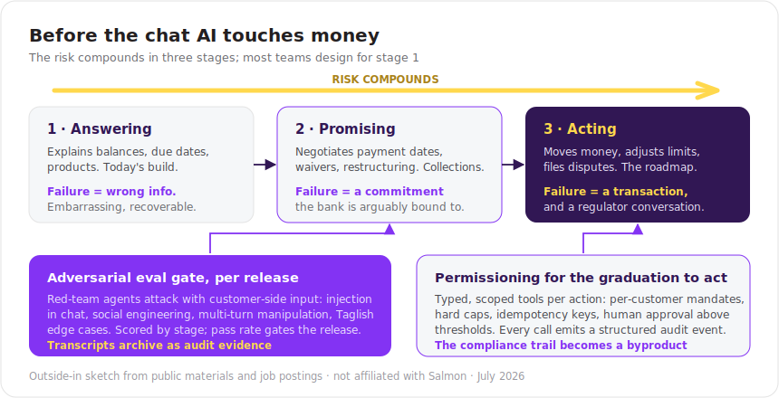

# Before the chat AI touches money

### An adversarial eval harness and permissioning pattern for a bank-grade LLM assistant, sketched against Salmon's public surface

> An independent, outside-in design note based on Salmon's (salmon.ph) public materials and job postings as of July 2026. Not affiliated with or endorsed by Salmon. Internals are hypotheses, flagged as such; the pattern adapts to any regulated fintech putting an LLM in the customer conversation.

## Respecting what already exists

Salmon's ML decisioning is proven at scale and publicly documented: 20-second underwriting on 100+ data points, in-house KYC that outperforms global vendors at a fraction of the cost, 99.9% uptime, and now a licensed bank. None of that is what this note is about.

It is about the newer surface their own hiring signals: an LLM assistant in the customer conversation (intent classification, prompt-tuned models, voice on the roadmap). Classic ML scoring fails *safe*: a bad score is a wrong number. A conversational LLM fails *active*: it can be talked into things.

## The risk compounds in three stages

Most teams design for stage 1 and discover stages 2 and 3 in production:

  

In collections especially, stage 2 arrives quietly: the assistant that "just answers questions" starts confirming payment arrangements, and a crafted sob story plus an injection payload should never produce an unauthorized waiver.

## Sketch 1: an adversarial eval gate per release

- A panel of red-team agents attacks each release candidate with hostile *customer-side* input: prompt injection inside chat messages, social-engineering scripts, multi-turn manipulation ("you already agreed earlier..."), and Taglish/code-switching edge cases, where model behavior is measurably weaker and real customers actually live.
- Score by stage: leaked data, promised beyond policy, attempted an action.
- Gate the release on pass rates; archive transcripts as audit artifacts. For a bank with a thrift-license application in flight and client-protection certification to defend, "we can prove the assistant resists abuse" is a compliance asset, not just an engineering nicety.

This adapts a method I have run in earnest: a 13-agent adversarial review that found two fatal flaws in a design before ship.

## Sketch 2: permissioning for the graduation to acting

When the assistant earns tools, give it *typed, scoped tools* rather than platform access:

- Each action (defer a payment, adjust a limit, file a dispute) is a schema-validated call with per-customer mandates, hard caps, idempotency keys, and human-approval gates above thresholds.
- Every call emits a structured audit event: who, which tool, what arguments, which policy verdict. The compliance trail becomes a byproduct of the architecture.
- This is the pattern I run in production for a paid, remote MCP server exposing data as agent-callable tools; pointed here at banking actions instead.

The same harness extends to voice when that ships: the attack corpus changes, the gate does not.

## The honest fine print

I do not know Salmon's actual chat architecture, what guardrails the team has already built, or how far the collections use case has progressed. Every claim above is a hypothesis to confirm against the real stack. If adversarial evals already run internally, this note is a conversation about method, not a diagnosis.

## References

Public materials this note is grounded in (as of July 2026):

- [TechCrunch, April 2026](https://techcrunch.com/2026/04/23/salmon-raises-100m-in-equity-and-debt-to-bring-digital-credit-to-underbanked-filipinos/): the $100M raise, 20-second decisions, real-time behavioral scoring
- [Backscoop interview with Raffy Montemayor](https://www.backscoop.com/newsletter-posts/ice-breakers-with-raffy-montemayor-co-founder-salmon): the in-house KYC tool and its cost/performance claims
- [Fintech News PH](https://fintechnews.ph/59619/sponsored/salmons-super-charged-journey-in-ai-enabled-consumer-lending/): AI-based facial recognition for identity verification, the AI banking team (sponsored content, so Salmon's own framing)
- [Salmon ML Engineer, NLP job posting](https://www.remocate.app/jobs/ml-engineer-nlp): the LLM/chat build signal this note keys on: intent classification, prompt fine-tuning, voice-bot roadmap
- [IFC partnership announcement](https://www.ifc.org/en/pressroom/2024/ifc-partners-with-consumer-fintech-salmon-to-drive-financial-inclusion-in-the-philippines): the financial-inclusion mandate and institutional posture

---

**Author:** Ronneil "N" Petterson, engineering leader, hands-on with agents. Manila. [beforeoafterm.io](https://beforeoafterm.io) · [LinkedIn](https://linkedin.com/in/beforeoafterm) · Related: [broker-copilot](https://github.com/beforeoafterm/broker-copilot), the 13-agent adversarial review method this note adapts.
